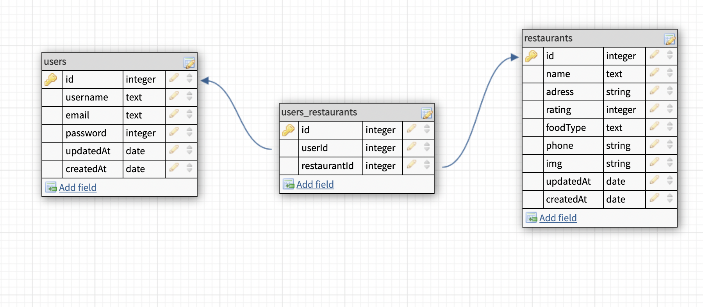

# MyFavRest

## Topics
- Description of the app
- MVP Goals
- Stretch Goals
- User stories
- Daily sprints
- Wireframes
- ERDs
- RESTful routing chart

##Description of the app
Find the restaurants you like in your area by name of restaurant, city or zipcode 
(available cities to search in for now: Seattle, LA and NY). 
App based on Yelp API.

##MVP goals
 - User can Sign up/ Log in and Log out
 - Input field to query serch
 - Favorite list of restaurants section
 - Add comments section
 
 
##Stretch goals
 - User can search restaurants by name, location, zipcode or food type
 - User can share the link of favorite restaurants on social media

##User Stories

 1. User can submit the query and get corresponding data (Title, Adress, food type and IMG)
 2. User can see the list of items appearing on the page with title and img
 3. User can see description about the restaurant, which was clicked on (Title, Description, IMG, reviw, phone, food type, adress)
 4. User will be able add (or delete) restaurant to favorite list
 5. User can sign up/ login and log out

##Daily Sprints

Monday:
test API
wireframe app
plan database ERD
plan routes
Tuesday:
create db models -- test db
stub routes -- test routes
build routes
Wednesday:
finish routes
create views
Thursday:
finish views
mvp
Friday:
debug refactor
style views
Saturday:
style views
stretch goals
Sunday:
stretch goals

 
##Wireframes

##ERDs
 

##RESTful routing chart

 Method |        URL        |     Functionality     |            View
--------|-------------------|-----------------------|---------------------------------
GET	    |   /restaurants    | list all restaurants  |   show restaurants/index.ejs
POST	|  /restaurants	    |   add a restaurant    |   redirect to /restaurants/:id
GET	    | /restaurants/:id	|  show one restaurant  |   show restaurants/detail.ejs
PUT  	| /restaurants/:id  | update one restaurant |   redirect to /restaurants/:id
DELETE	| /restaurants/:id	| delete one restaurant |   redirect to /restaurants