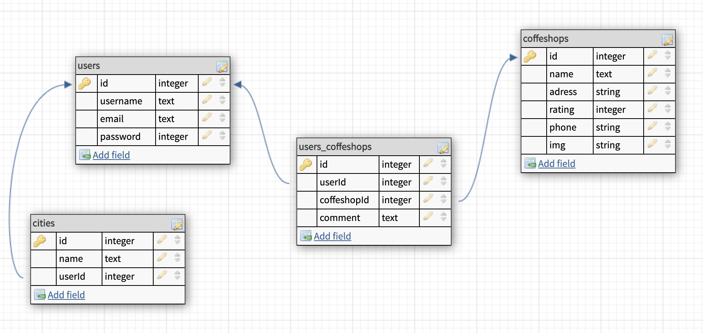

# CoffeeMe

## Topics
- Description of the app
- MVP Goals
- Stretch Goals
- User stories
- Daily sprints
- Wireframes
- ERDs
- RESTful routing chart

##Description of the app
Find the coffeshops you like in your area by name of coffeshop. 
App based on Yelp API (https://www.yelp.com/developers/documentation/v3/get_started).

##MVP goals
 - User can Sign up/ Log in and Log out
 - Input field to query serch
 - Favorite list of coffeshops section
 - Add comments section

##Stretch goals
 - User can search coffeshops by name or location
 - User can share the link of favorite coffeshops on social media

##User Stories

 1. User can submit the query and get corresponding data (Title, Adress and IMG)
 2. User can see the list of items appearing on the page with title and img
 3. User can see description about the coffeshop, which was clicked on (Title, Description, IMG, reviw, phone, food type, adress)
 4. User will be able add (or delete) coffeshop to favorite list
 5. User can sign up/ login and log out

##Daily Sprints

Monday:
test API
wireframe app
plan database ERD
plan routes
Tuesday:
create db models -- test db
stub routes -- test routes
build routes
Wednesday:
finish routes
create views
Thursday:
finish views
mvp
Friday:
debug refactor
style views
Saturday:
style views
stretch goals
Sunday:
stretch goals

 
##Wireframes

##ERDs
 

##RESTful routing chart

 Method |        URL        |     Functionality     |            View
--------|-------------------|-----------------------|---------------------------------
GET	    |   /coffeshops     | list all coffeshops   |   show coffeshops/index.ejs
POST	|  /coffeshops	    |   add a coffeshops    |   redirect to /coffeshops/:id
GET	    | /coffeshops/:id	|  show one coffeshop   |   show coffeshops/detail.ejs
PUT  	| /coffeshops/:id   | update one coffeshop  |   redirect to /coffeshops/:id
DELETE	| /coffeshops/:id	| delete one coffeshop  |   redirect to /coffeshops
